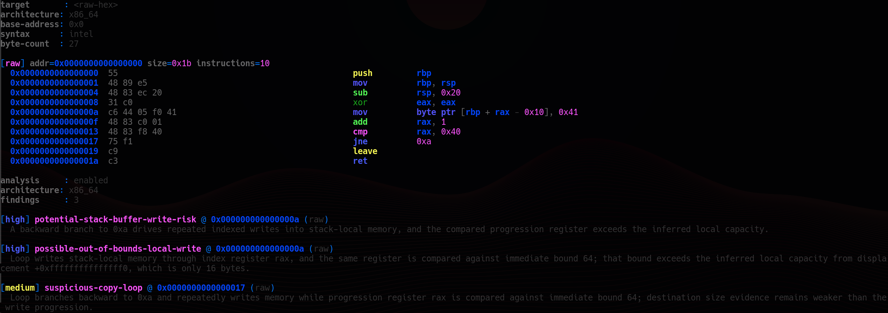

# assembler

<p align="center">
  <strong>A Rust disassembler for raw opcode streams, object-backed executable code, symbol-scoped inspection, and conservative semantic post-processing from the command line.</strong>
</p>

## Output preview

### Pretty output

<p align="center">
  
</p>

### Plain output

<p align="center">
  
</p>

### Analysis output

<p align="center">
  
</p>

## Overview

`assembler` is a terminal-oriented disassembly frontend implemented in Rust. It accepts either raw machine-code bytes or object-backed binaries, decodes instructions through Capstone, resolves section and symbol context through `object`, and renders normalized assembly listings for interactive reverse engineering, shell-driven inspection, and captured output.

The project is intentionally constrained to decoding, rendering, and conservative semantic reporting. It is not a decompiler, source reconstructor, symbolic executor, or exploitability oracle. The analysis mode is designed to stay evidence-backed and architecture-aware rather than turning mnemonic names or imported APIs into unsupported vulnerability claims.

## Core capabilities

- Decode raw machine code from hex input with explicit architecture selection
- Disassemble executable sections from ELF and other object-backed binaries parsed through `object`
- Restrict file disassembly to selected symbols or sections for targeted inspection
- Emit Intel syntax by default for x86 and x86_64, with optional AT&T syntax via `--syntax att`
- Render either structured pretty output or flat plain output depending on terminal context and workflow needs
- Preserve ANSI color support in both render modes
- Fall back to plain output automatically when stdout is not a TTY
- Run conservative semantic analysis with `--analyze` for supported x86 and x86_64 disassembly
- Escape hostile terminal content and enforce explicit input-size limits for safer CLI use

## Build and execution

### Requirements

- Rust toolchain with Cargo
- A working C compiler only if you want to build the demo target in `examples/password-login/`

### Build from source

```bash
cargo build --release
```

### Show CLI help

```bash
cargo run -- --help
```

## CLI model

The tool operates in two primary input modes:

1. **Raw-byte mode** via `--raw-hex`
2. **File mode** via a positional `FILE` argument

Raw-byte disassembly requires an explicit architecture because there is no container metadata to infer decode mode safely. File mode uses object metadata where possible, with explicit ARM/Thumb override support when metadata alone is not sufficient.

### Synopsis

```text
assembler [FILE] [OPTIONS]
assembler --raw-hex <HEX> [OPTIONS]
```

### Primary options

| Option | Purpose | Notes |
|---|---|---|
| `FILE` | Binary or object file to disassemble | Required unless `--raw-hex` is provided |
| `--raw-hex <HEX>` | Decode raw machine code bytes | Conflicts with file input |
| `--arch <ARCH>` | Force architecture or override decode mode | Required for raw input |
| `--base-address <ADDR>` | Base address for raw-byte output | Raw mode only in practice |
| `--all-sections` | Include every non-empty section | Default file mode prefers executable sections |
| `--section <NAME>` | Restrict file disassembly to named section(s) | May be repeated |
| `--symbol <NAME>` | Restrict file disassembly to named symbol(s) | File mode only; may be repeated |
| `--syntax <intel\|att>` | x86/x86_64 syntax selection | Default is `intel` |
| `--render <auto\|pretty\|plain>` | Output layout selection | `auto` follows TTY state |
| `--color <auto\|always\|never>` | ANSI color control | `auto` respects terminal conditions |
| `--analyze` | Run conservative semantic analysis on decoded disassembly | Analysis is currently implemented for x86 and x86_64 |

## Quick-start workflows

### Decode a minimal x86_64 function from raw bytes

```bash
cargo run -- --raw-hex "55 48 89 e5 5d c3" --arch x86-64
```

### Force pretty output

```bash
cargo run -- --raw-hex "55 48 89 e5 5d c3" --arch x86-64 --render pretty --color never
```

### Force plain output with ANSI color

```bash
cargo run -- --raw-hex "55 48 89 e5 5d c3" --arch x86-64 --render plain --color always
```

### Disassemble a single symbol from a binary

```bash
cargo run -- ./target/debug/assembler --symbol main
```

### Restrict output to selected sections

```bash
cargo run -- ./target/debug/assembler --section .text --section .init
```

### Add semantic analysis to a raw disassembly run

```bash
cargo run -- --raw-hex "55 48 89 e5 5d c3" --arch x86-64 --analyze
```

## Output behavior

### Render mode

- `--render auto`
  - pretty output on interactive terminals
  - plain output when stdout is captured or piped
- `--render pretty`
  - forces structured box-oriented output
- `--render plain`
  - forces flat text output suitable for logs, grep, and pipelines

### Color mode

- `--color auto`
  - enables color on interactive terminals
  - disables color when `NO_COLOR` is present
  - disables color when `TERM=dumb`
- `--color always`
  - forces ANSI color even in plain output
- `--color never`
  - disables ANSI color entirely

## Architecture support

### Supported decode targets

| Target | Input mode | Notes |
|---|---|---|
| x86 | raw bytes, file-backed | Intel syntax default, AT&T optional |
| x86_64 | raw bytes, file-backed | Intel syntax default, AT&T optional |
| AArch64 | raw bytes, file-backed when metadata is sufficient | Use `--arch aarch64` for raw input |
| ARM | file-backed with explicit override | Use `--arch arm` |
| Thumb | file-backed with explicit override | Use `--arch thumb` |

### Architecture notes

- Raw-byte disassembly requires `--arch`
- ARM and Thumb are intentionally explicit in file mode because object metadata alone is not always sufficient to infer the correct decode mode safely
- `--syntax att` only affects x86 and x86_64 output

## Semantic analysis mode

`--analyze` appends a dedicated analysis section after the disassembly report. The analyzer consumes Capstone detail-mode output and uses typed operand information, memory addressing structure, access direction, and limited frame/loop reconstruction to emit conservative findings.

### Current analysis scope

The current implementation is intended for **x86** and **x86_64** disassembly. For unsupported architectures, analysis mode remains explicit but will report that no architecture-specific semantic analyzer is currently implemented.

### Finding model

Each reported finding is structured around:

- finding class
- severity tier
- address and section/symbol context
- factual rationale grounded in decoded instruction behavior

### Current finding classes

- potential stack-buffer write risk
- possible out-of-bounds local write
- suspicious copy loop
- unsafe stack-frame write
- stack-pointer / frame-pointer anomaly
- indirect write risk

### Analysis constraints

The analyzer is deliberately conservative.

- It does **not** claim exploitability from disassembly alone
- It does **not** promote imported APIs or mnemonic names into findings without behavioral evidence
- It does **not** attempt source reconstruction or decompilation
- It does **not** treat weak evidence as proof of a specific overwrite primitive

## Deterministic fixture corpus

The repository includes a dedicated `fixtures/` workspace member for deterministic verification targets. This crate contains hand-authored `global_asm!` symbols rather than compiler-generated Rust or C output, which makes it useful for analyzer regression testing, renderer verification, and cross-architecture expansion without depending on incidental codegen details.

### What the fixtures are for

- exact x86_64 analyzer fixtures for every current finding class
- exact negative fixtures for false-positive resistance
- AArch64 renderer fixtures for token and mnemonic verification
- stable symbol-scoped targets for `--symbol ... --analyze --output json`

### Build the fixture binary

```bash
cargo build -p fixtures
```

### Run the fixture integration tests

```bash
cargo test --test fixtures
```

### Inspect one positive fixture manually

```bash
cargo run -- ./target/debug/fixtures --symbol fixture_stack_local_unbounded_loop --analyze --output json
```

### Fixture authoring rules

- fixture symbols are named with the `fixture_` prefix
- x86_64 fixtures use exact `global_asm!` instruction sequences and explicit `.size` directives so symbol-scoped disassembly works reliably
- local labels use the `.L_<fixture_name>_<label>` convention to avoid cross-fixture collisions
- fixture code lives in `fixtures/`, never in the production `src/` tree
- AArch64 fixture compilation in CI uses `aarch64-unknown-linux-gnu` plus a Linux cross-linker; the host does not execute the resulting binary, it only disassembles it

## Reverse-engineering example

`examples/password-login/` contains a compact C target compiled to preserve straightforward machine code:

- debug information is retained
- inlining is disabled
- builtin substitution is suppressed
- the binary is linked as non-PIE

This produces a small ELF sample that is convenient for symbol-scoped inspection and low-level control-flow review.

### Build the demo target

```bash
gcc -O0 -g -fno-inline -fno-builtin -no-pie -o examples/password-login/secret_login examples/password-login/secret_login.c
```

### Inspect the password-check function

```bash
cargo run -- examples/password-login/secret_login --symbol check_password --render pretty --color never
```

### Run the analyzer on the same symbol

```bash
cargo run -- examples/password-login/secret_login --symbol check_password --analyze --render plain --color never
```

The resulting disassembly exposes `check_password` as a linear sequence of immediate byte comparisons. That makes the validation logic visible directly at the instruction level without requiring a decompiler or source access.

In analysis mode, this example should remain a **negative case** for supported memory-safety findings. The function compares bytes against a caller-controlled pointer, but it does not exhibit the local copy or repeated stack-write behavior required for an overflow-style report.

For the full walkthrough, see:

```text
examples/password-login/README.md
```

## Safety and robustness

- Hostile strings are escaped before rendering to reduce terminal-control abuse
- Pretty output preserves full instruction text instead of clipping operands or labels
- Raw hex input is capped at **8192 decoded bytes** to bound decode cost and output volume
- Input files must be regular files and are capped at **128 MiB**
- Symbol selection is limited to file input and validated with explicit error reporting
- Non-interactive output defaults to a stable plain-text representation

## Compatibility matrix

| Area | Status | Notes |
|---|---|---|
| x86 raw bytes | supported | Intel syntax default, AT&T optional |
| x86_64 raw bytes | supported | Intel syntax default, AT&T optional |
| AArch64 raw bytes | supported | use `--arch aarch64` |
| ARM object files | explicit override required | use `--arch arm` or `--arch thumb` |
| Symbol filtering | supported for file input | `--symbol` is rejected for raw hex |
| Section filtering | supported for file input | `--section` may be repeated |
| Pretty output | supported | default on interactive terminals |
| Plain output | supported | default for captured or piped output |
| ANSI color in plain mode | supported | use `--render plain --color always` |
| Semantic analysis | supported for x86/x86_64 | enabled with `--analyze` |
| CI verification | supported | GitHub Actions runs formatting, clippy, tests, fixture verification, and smoke verification |

## Verification

```bash
cargo fmt --check
cargo clippy --all-targets -- -D warnings
cargo build -p fixtures
cargo test
cargo test --test fixtures
bash scripts/smoke.sh
```

## Manual QA for analysis mode

```bash
cargo run -- examples/password-login/secret_login --symbol check_password --analyze --render plain --color never
cargo run -- --raw-hex "55 48 89 e5 48 83 ec 20 31 c0 c6 44 05 f0 41 48 83 c0 01 48 83 f8 40 75 f1 c9 c3" --arch x86-64 --analyze --render plain --color never
```

Expected outcome:

- the password example reports no supported memory-safety findings
- the synthetic raw-hex loop reports evidence-backed findings for repeated stack-local writes and weak destination-bound evidence

## Project layout

```text
src/                         main CLI implementation
fixtures/                    deterministic assembly fixture corpus
tests/                       integration tests
scripts/smoke.sh             quick verification script
examples/password-login/     reverse-engineering demo target
```

## Implementation notes

- Language: Rust 2024 edition
- Decoder backend: Capstone
- Object parsing and symbol extraction: `object`
- CLI parsing: `clap`
- Error handling: `anyhow`

This repository is optimized for low-friction local use: build the binary, point it at raw bytes or a target file, and get deterministic decoded output with optional semantic post-processing from the same command-line entry point.
