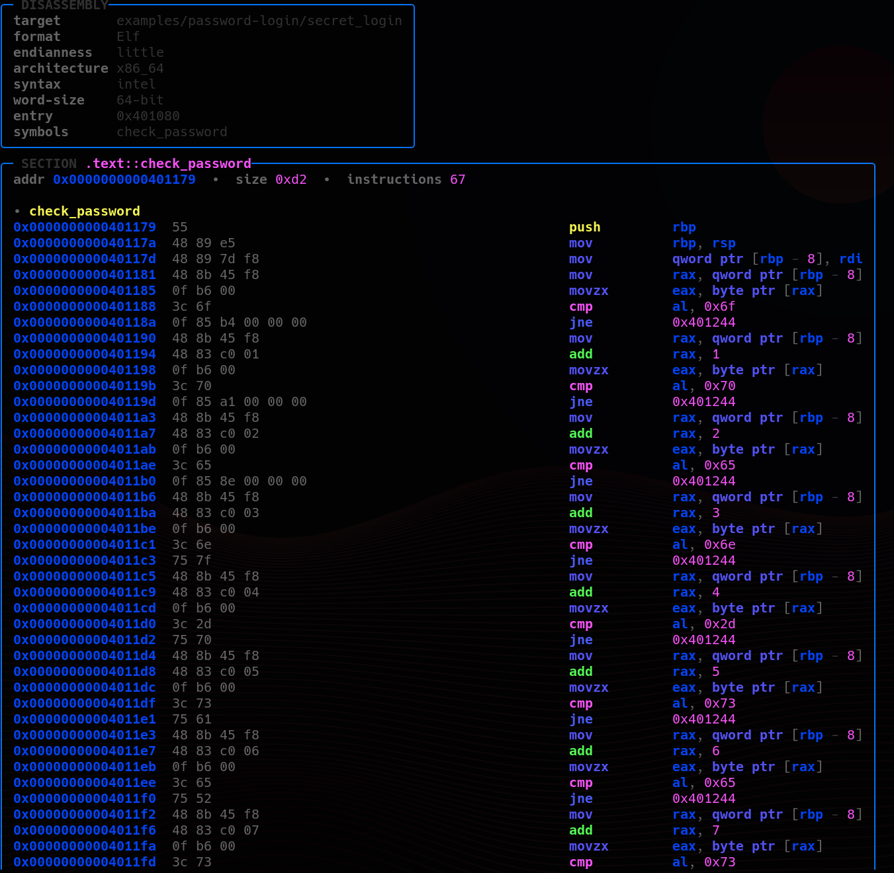
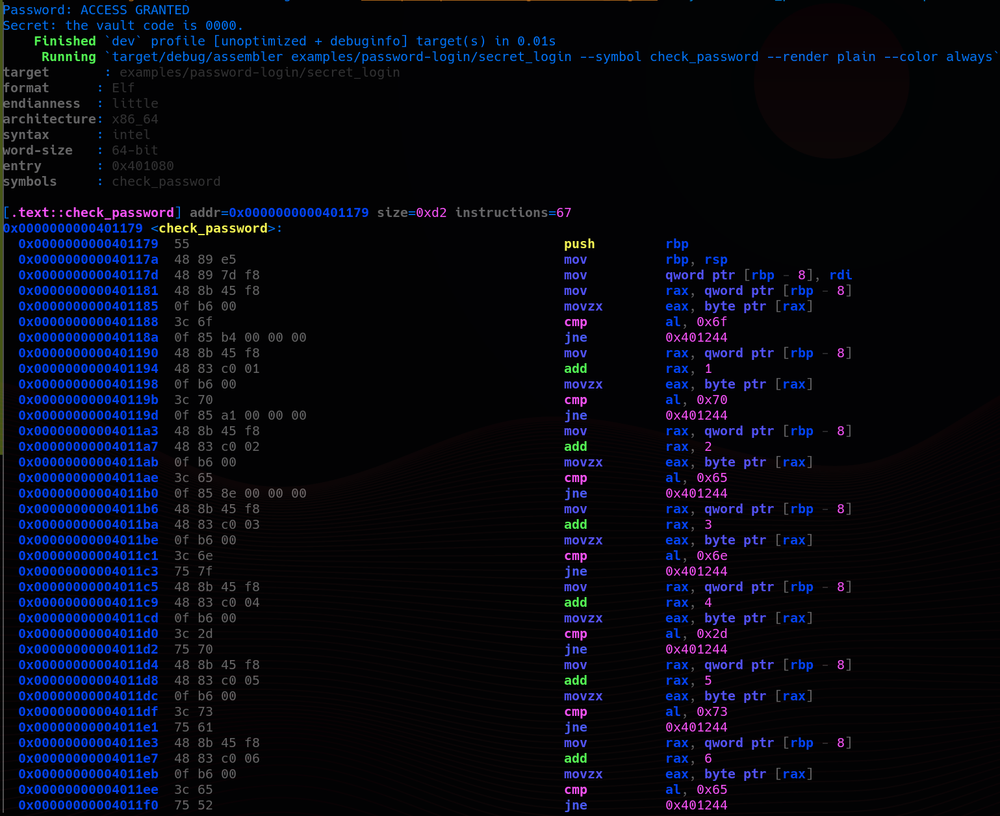

# assembler

<p align="center">
  <strong>A terminal-first Rust disassembler I built to inspect machine code from raw bytes, binaries, and individual symbols without leaving the shell.</strong>
</p>

## Output preview

### Pretty output

<p align="center">
  
</p>

### Plain output

<p align="center">
  
</p>

## Why I built this

I wanted a disassembler that feels direct: point it at raw hex, an object or executable, or one specific symbol, and get readable assembly immediately. `assembler` is the tool I built for that workflow. It is focused, scriptable, careful about terminal behavior, and clean enough to use both interactively and in captured output.

## What it does

- Disassembles raw hex bytes
- Disassembles executable sections from binaries parsed through `object`
- Focuses output with `--symbol` and `--section`
- Uses Intel / AMD-style syntax by default for x86 and x86_64
- Supports optional AT&T syntax with `--syntax att`
- Renders both pretty and plain output
- Supports ANSI coloring in both pretty and plain modes
- Falls back to plain output automatically for captured / non-TTY output
- Escapes hostile terminal content and enforces input limits

## Quick start

### Show help

```bash
cargo run -- --help
```

### Disassemble raw bytes

```bash
cargo run -- --raw-hex "55 48 89 e5 5d c3" --arch x86-64
```

### Force pretty output

```bash
cargo run -- --raw-hex "55 48 89 e5 5d c3" --arch x86-64 --render pretty --color never
```

### Force plain output with color

```bash
cargo run -- --raw-hex "55 48 89 e5 5d c3" --arch x86-64 --render plain --color always
```

### Disassemble one symbol from a binary

```bash
cargo run -- ./target/debug/assembler --symbol main
```

### Restrict output to selected sections

```bash
cargo run -- ./target/debug/assembler --section .text --section .init
```

## Reverse-engineering workflow example

I also added a small C demo in `examples/password-login/` to show exactly why this tool is useful.

Build the demo binary:

```bash
gcc -O0 -g -fno-inline -fno-builtin -no-pie -o examples/password-login/secret_login examples/password-login/secret_login.c
```

Then disassemble only the password check:

```bash
cargo run -- examples/password-login/secret_login --symbol check_password --render pretty --color never
```

The output shows the password logic as immediate byte comparisons inside `check_password`. In other words, the secret falls straight out of the disassembly. That is exactly the kind of failure this tool makes obvious.

For the full walkthrough, see:

```text
examples/password-login/README.md
```

## Output behavior

### Render mode

- `--render auto`
  - interactive terminal: pretty output
  - captured / piped output: plain output
- `--render pretty`
  - always uses the structured box layout
- `--render plain`
  - always uses the flat text layout

### Color mode

- `--color auto`
  - enables color on interactive terminals
  - disables color when `NO_COLOR` is present
  - disables color when `TERM=dumb`
- `--color always`
  - forces ANSI coloring, including plain mode
- `--color never`
  - disables ANSI coloring completely

## Architecture notes

- Default x86 / x86_64 syntax is `intel` (Intel / AMD-style)
- `att` remains available with `--syntax att`
- Raw-byte disassembly requires `--arch`
- AArch64 raw disassembly is supported with `--arch aarch64`
- ARM file disassembly requires an explicit mode choice:
  - `--arch arm`
  - `--arch thumb`

I made that ARM behavior explicit on purpose. Object metadata is not always enough to infer the correct ARM decode mode safely.

## Safety and robustness

- Hostile strings are escaped before rendering
- Pretty output preserves full instruction text instead of clipping it
- Raw hex input is capped at 8192 decoded bytes
- Input files must be regular files and are capped at 128 MiB
- Symbol selection is file-only and validated clearly on error

## Compatibility matrix

| Area | Status | Notes |
|---|---|---|
| x86 raw bytes | supported | Intel / AMD-style syntax by default, AT&T optional |
| x86_64 raw bytes | supported | Intel / AMD-style syntax by default, AT&T optional |
| AArch64 raw bytes | supported | explicit `--arch aarch64` |
| ARM object files | explicit override required | use `--arch arm` or `--arch thumb` |
| Symbol filtering | supported for file input | `--symbol` is rejected for raw hex |
| Pretty output | supported | default on interactive terminals |
| Plain output | supported | default for non-TTY / captured output |
| ANSI color in plain mode | supported | use `--render plain --color always` if you want flat colored output |
| CI verification | supported | GitHub Actions runs fmt, tests, and smoke verification |

## Verification

```bash
cargo fmt --check
cargo test
bash scripts/smoke.sh
```

## Project layout

```text
src/                         main CLI implementation
tests/                       integration tests
scripts/smoke.sh             quick verification script
examples/password-login/     reverse-engineering demo target
```
